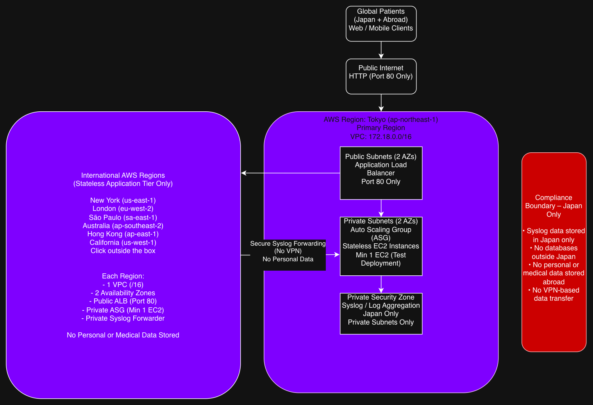

  

🏥 J-Tele-Doctor — Global AWS Architecture (Terraform)
Overview

J-Tele-Doctor is a multi-region AWS architecture designed for a Japanese healthcare provider to deliver telemedicine services globally while enforcing strict Japan-centric data residency and compliance.

The platform provides low-latency access for traveling patients while ensuring that all sensitive and stateful services remain in Japan.

🎯 Key Design Goals

Global application availability with low latency

Japan-only storage of personal and medical data

Stateless application tiers outside Japan

Controlled cross-region communication

Infrastructure delivered using Terraform and CI/CD

🌍 Regions
Primary Region

Tokyo (ap-northeast-1)

Central logging

Databases (Stage 2)

SIEM and security tooling

Transit Gateway hub

International Application Regions (Stateless Only)

New York (us-east-1)

London (eu-west-2)

São Paulo (sa-east-1)

Australia (ap-southeast-2)

Hong Kong (ap-east-1)

California (us-west-1)

🏗️ Architecture Summary

One VPC per region (/16)

Minimum two Availability Zones per region

Public ALB (port 80 only)

Private Auto Scaling Groups (min 1 EC2 for test)

No public access to compute resources

🔁 Traffic Flow (High Level)
Users → Public Internet → Regional ALB → Private App Tier

Applications are stateless in all international regions

Logs are forwarded securely to Japan

No personal or medical data is stored outside Japan

🌐 Transit Gateway (Stage 2)

Each region has its own Transit Gateway

Inter-region TGW peering with Tokyo as the hub

TGW route tables allow operational logs only

Databases and sensitive data are never accessible outside Japan

🛡️ Compliance Boundary

Syslog and security data stored in Japan only

Databases deployed in Japan only

No personal or medical data stored abroad

Route-restricted inter-region connectivity

No VPN-based data transfer

⚙️ Infrastructure as Code & CI/CD

Terraform used for all infrastructure

Multi-region consistency and auditability

CI/CD pipelines enforce:

Validation and security checks

Controlled applies

Safe rollback via version control

## Architecture Overview

## Architecture Overview

![J-Tele-Doctor Global AWS Architecture](./j-tele-doctor-global-aws-architecture2.drawio.png

